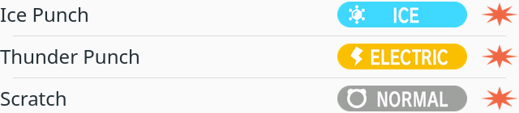
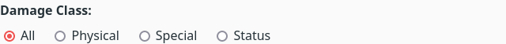
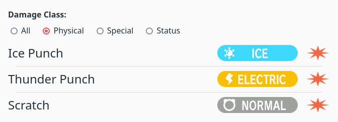

# Take-home PokéAPI

You'll be building a simple app using data from the [PokéAPI](https://pokeapi.co/).

The purpose of your app will be to serve as a simple yet effective tool for people to learn about different moves in the _Pokémon_ games. For example, a user might know the name of a move, but not its type. Your app can help them.

> **Note:** Designs for components are provided and sufficient. You are free to use your own designs or make changes where you see fit. You might be asked to explain your process if you do.

## Setup

Create a fresh project using your frontend framework of choice. A quick solution is to use a [Vite template](https://vitejs.dev/guide/#scaffolding-your-first-vite-project).

- Use either TypeScript or JSDoc for type hinting
- When you're done, share the code through email (either a repo link or attached)

## Tips

1. Read this briefing in its entirety before you start writing code.
2. Keep a pen and paper ready to help you think e.g. by drawing a diagram.
3. This should not take you more than 2-3 hours. Spending less is better than spending more. We respect your time.
4. Focus on quality rather than quantity. It's okay to omit functionality if you run out of time.

For bonus points, you can pick one or two topics from the following list and spend some time applying your knowledge to the project. This is fully optional.

- Documentation
- Accessibility
- User experience
- Automated tests
- Animation
- Custom designs
- Data caching
- Git workflow

## Step 1

Create a reusable component to display the basic information of a single move.

Here is a simplified version of a move's data:

```js
const moveData = {
  id: 9,
  name: "Thunder Punch",
  type: "electric",
  damage_class: "physical",
};
```

You can use this design:


- This example has a `40rem` width
- Both images have a `2rem` height
- The text is `font-size: 1.5rem`
- Space between elements is `1rem`
- Images for the `type` can be found in `assets/type-icons`
- Images for the `damage_class` can be found in `assets/damage-class-icons`
- There are some base CSS rules you can use in `assets/styles.css` 

## Step 2

Create a component that can display the entire list of moves. The list contains 919 entries.

- Fetch the data from this API endpoint: https://pokeapi.co/api/v2/move?limit=919
- The docs for this endpoint are here: https://pokeapi.co/docs/v2#moves

The endpoint with the list doesn't contain all the information we want, so a separate request to the `url` for each item in the `results` will need to be made.

You can use this design:



- The vertical distance between two items is `1rem`
- A line appears in that gap, and is centered both vertically and horizontally
- The horizontal line is `1px solid hsl(0, 0%, 86%)` and has a `95%` width

## Step 3

Create a component that allows users to filter the list by their `damage_class`. Only show items in the list that belong to the selected value.

You can use this design:



- The filter has 4 options: "All" (default), "Physical", "Special" and "Status"
- Regular `<input type="radio">` is sufficient, same goes for `font-size: 1rem`
- Vertical space between the text and input group is `0.5rem`
- Horizontal space between an `<input>` and its `<label>` is `0.25rem`
- Horizontal space between different options in the group is `1rem`

Here is the design in context:



- Vertical distance between the filter and the list is `1rem`

## Finalizing

When you've reached this point, write down a quick estimate of the time you spent and then read the [Setup](#setup) and [Tips](#tips) again for the next steps.
